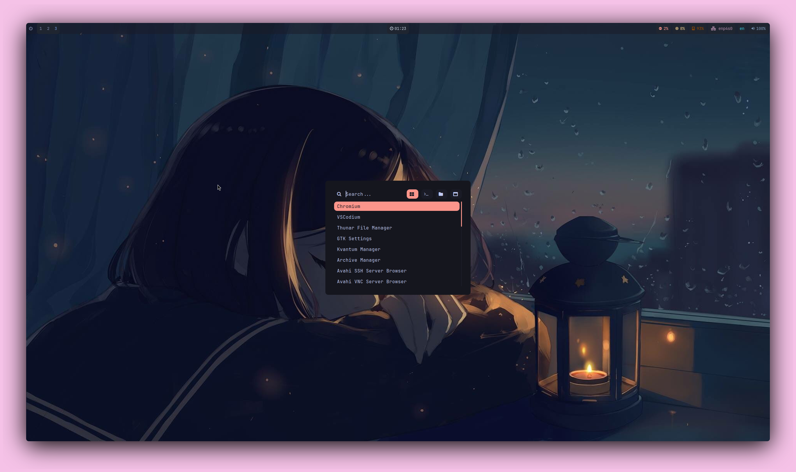

# Arch Linux Hyprland Dotfiles

Minimalistic with a few quality-of-life additions (such as Kvantum and nwg-look for easier customisation).

Inspired by:

- https://github.com/linuxmobile/hyprland-dots
- https://github.com/1amSimp1e/dots

AUR Helper: [yay](https://github.com/Jguer/yay)

## Preview

    
Waybar and Wallpaper

    

    
Terminal

    

    
Rofi

    

    
Thunar

    

## Shell

Zsh with [oh-my-zsh](https://ohmyz.sh/)

oh-my-zsh plugins:

- [git](https://github.com/ohmyzsh/ohmyzsh/tree/master/plugins/git)
- [zsh-autosuggestions](https://github.com/zsh-users/zsh-autosuggestions)
- [zsh-syntax-highlighting](https://github.com/zsh-users/zsh-syntax-highlighting)

## Installed Packages

### Compositor
- hyprland
- xdg-desktop-portal-hyprland

### GPU Support
- linux-headers
- nvidia-dkms
- nvidia-utils
- libva

### Terminal
- kitty
- neovim
- zsh
- bat
- eza
- ripgrep

### Authentication Agent
- polkit-kde-agent

### Fonts
- ttf-jetbrains-mono-nerd
- noto-fonts-emoji
- ttf-font-awesome

### QT Support
- qt5ct
- qt5-wayland
- qt6-wayland
- kvantum
- qt5-quickcontrols
- qt5-quickcontrols2
- qt5-graphicaleffects

### GDK Support
- nwg-look

### Audio Server
- pipewire
- wireplumber
- pavucontrol
- pamixer

### Wallpapers
- swaybg

### Status Bar
- waybar-hyprland

### Notification Daemon
- dunst

### Clipboard Management
- cliphist
- wl-clipboard

### Browser
- chromium

### Graphical IDE
- vscodium-bin

### File Explorer
- thunar
- file-roller

### Screenshots
- imagemagick
- colord
- grimblast-git

### Application Laucher
- rofi-lbonn-wayland-git

### Logout Menu
- wlogout

### Desktop Session Management
- sddm
